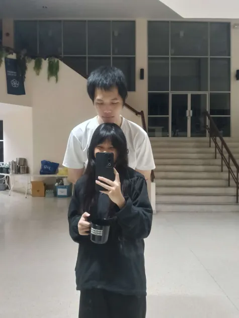
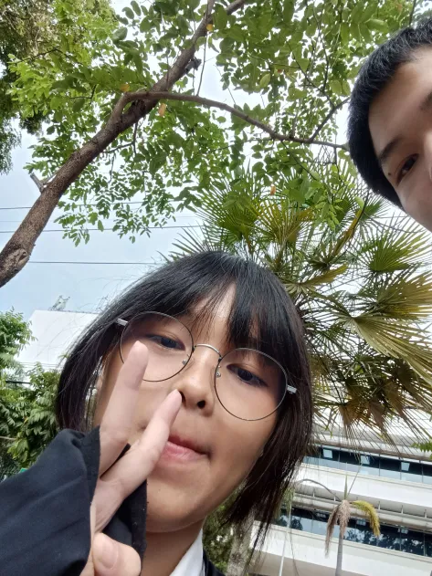

<!DOCTYPE html>
<html>
<head>
  <meta charset="utf-8">
  <title>For My Love</title>
  
</head>
<body>
  <h1>💖 Forever With You 💖</h1>

  <!-- รูปของหนูกับแฟน -->
  
  
  
  
  
  
  
  

  <!-- อีโมจิหัวใจ -->
  
❤️

  
💖

  
💕

  
💘

  <!-- คลิปวิดีโอ -->
  <video id="surpriseVideo" width="480" controls>
    <source src="VID20250818204341.mp4" type="video/mp4">
    Your browser does not support the video tag.
  </video>

  
</body>
</html>
